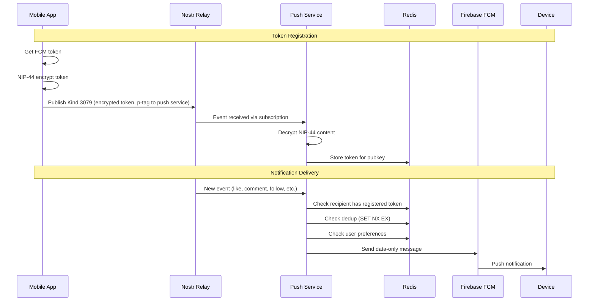

# Developer Guide

## Architecture Overview

divine-push-service is a single-app Nostr push notification service. It connects to Nostr relays, watches for events that should trigger notifications, and delivers them via Firebase Cloud Messaging (FCM).



## Event Kinds

| Kind | Direction | Purpose |
|------|-----------|---------|
| 3079 | Client → Relay → Service | Register FCM push token (NIP-44 encrypted) |
| 3080 | Client → Relay → Service | Deregister push token (NIP-44 encrypted) |
| 3083 | Client → Relay → Service | Update notification preferences (optional) |

See [NIP-XX Push Notifications](nip-xx-push-notifications.md) for the full protocol specification.

## Notification Types

The service watches for these event kinds and notifies the tagged recipient:

| Type | Event Kind | Trigger |
|------|-----------|---------|
| Like | 7 | Reaction to user's note (p-tag) |
| Comment | 1 | Reply to user's note (p-tag, with e-tag reference) |
| Follow | 3 | New contact list including user (p-tag) |
| Mention | 1 | Note mentioning user (p-tag, no e-tag reference) |
| Repost | 16 | Repost of user's note (p-tag) |

## FCM Payload Format

The service sends **data-only** FCM messages (no `notification` field). This gives the client full control over how notifications are displayed.

```json
{
  "data": {
    "type": "Like",
    "eventId": "abc123...",
    "title": "New like",
    "body": "Alice liked your post",
    "senderPubkey": "def456...",
    "senderName": "Alice",
    "receiverPubkey": "789abc...",
    "receiverNpub": "npub1...",
    "eventKind": "7",
    "timestamp": "1712345678",
    "referencedEventId": "fedcba..."
  }
}
```

### Fields

| Field | Type | Description |
|-------|------|-------------|
| `type` | string | `Like`, `Comment`, `Follow`, `Mention`, or `Repost` |
| `eventId` | hex | The Nostr event that triggered the notification |
| `title` | string | Human-readable title (e.g. "New like") |
| `body` | string | Human-readable body (e.g. "Alice liked your post") |
| `senderPubkey` | hex | Pubkey of the user who triggered the event |
| `senderName` | string | Display name or truncated npub of the sender |
| `receiverPubkey` | hex | Pubkey of the notification recipient |
| `receiverNpub` | bech32 | Bech32-encoded npub of the recipient |
| `eventKind` | string | Nostr event kind as string (e.g. "7") |
| `timestamp` | string | Unix timestamp of the event as string |
| `referencedEventId` | hex | (optional) The event being reacted to or replied to |

### Client Handling

Since these are data-only messages:
- **Android**: The app must create and display the notification itself via `onMessageReceived`
- **iOS**: The app must use a Notification Service Extension or handle via `application:didReceiveRemoteNotification:`
- **Foreground**: The app receives the data and decides whether/how to show it
- **Background**: A background handler must create a local notification from the data fields

## Service Discovery

The push service exposes its public key via the `/health` endpoint:

```
GET /health
```

```json
{
  "status": "ok",
  "pubkey": "abc123..."
}
```

Clients use this pubkey to:
- Set the `p` tag on Kind 3079/3080/3083 events
- Encrypt the NIP-44 content to the service's key

## Deduplication

The service uses atomic Redis `SET NX EX` per-event keys to prevent duplicate notifications across multiple replicas. Each event is claimed exactly once with a 7-day TTL.

## User Preferences

Users can optionally send a Kind 3083 event to control which notification types they receive. The decrypted content is:

```json
{ "kinds": [1, 3, 7, 16] }
```

This is a list of event kinds the user wants notifications for. If no preferences are set, the service uses defaults: text notes (1), follows (3), reactions (7), reposts (16), and long-form content (30023).

## Redis Keys

| Key Pattern | Type | Description |
|-------------|------|-------------|
| `user_tokens:{pubkey}` | Set | FCM tokens registered for a pubkey |
| `token_to_pubkey` | Hash | Reverse mapping from token to owner pubkey |
| `stale_tokens` | Sorted Set | Token timestamps for cleanup |
| `dedup:{event_id}` | String | Deduplication lock with TTL |
| `divine:preferences:{pubkey}` | String | JSON notification preferences |
