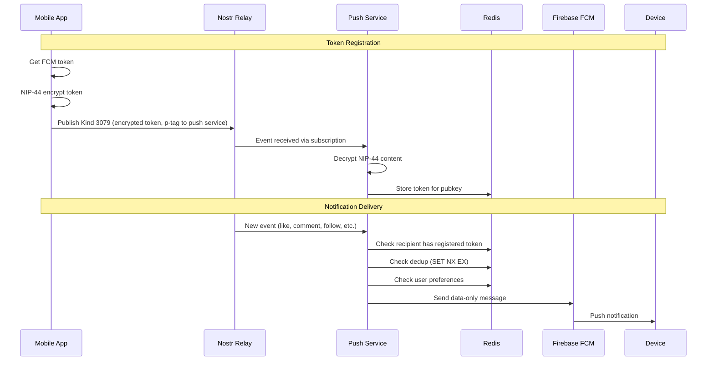

# Developer Guide

## Architecture Overview

divine-push-service is a single-app Nostr push notification service. It connects to Nostr relays, watches for events that should trigger notifications, and delivers them via Firebase Cloud Messaging (FCM).



## Event Kinds

| Kind | Direction | Purpose |
|------|-----------|---------|
| 3079 | Client → Relay → Service | Register FCM push token (NIP-44 encrypted) |
| 3080 | Client → Relay → Service | Deregister push token (NIP-44 encrypted) |
| 3083 | Client → Relay → Service | Update notification preferences (optional) |

See [NIP-XX Push Notifications](nip-xx-push-notifications.md) for the full protocol specification.

## Notification Types

The service watches for these event kinds and notifies the tagged recipient:

| Type | Event Kind | Trigger |
|------|-----------|---------|
| Like | 7 | Reaction to user's note (p-tag) |
| Comment | 1 | Reply to user's note (p-tag, with e-tag reference) |
| Follow | 3 | New contact list including user (p-tag) |
| Mention | 1 | Note mentioning user (p-tag, no e-tag reference) |
| Repost | 16 | Repost of user's note (p-tag) |

> **Note:** Follow (kind 3) is defined but **not currently emitted** — the handler skips kind 3 because new-follow detection requires diffing contact-list state, which is not yet implemented. Likes, comments, mentions, and reposts are the types actually delivered today.

## FCM Payload Format

The FCM message carries **no top-level `notification` field** — the `data` map below is always present and is identical in shape for every notification type (only the `title`/`body` strings differ); every `data` value is a string. Per-platform delivery then diverges so that **one incoming push produces exactly one visible banner**:

- **Android** — data-only (`notification` and `android` unset). Android does not auto-display data messages, so the app renders the single banner itself from the `data` fields.
- **iOS** — the service attaches an APNS override: `aps.alert` (title/body) + `mutable-content: 1`, push-type `alert`, priority 10. The OS presents the single banner; a Notification Service Extension (if shipped) uses `mutable-content` to *enrich* that same banner, never to create a second one. `content-available` is deliberately omitted — see [Avoiding duplicate banners](#avoiding-duplicate-banners).

```json
{
  "data": {
    "type": "like",
    "eventId": "abc123...",
    "title": "New like",
    "body": "Alice liked your post",
    "senderPubkey": "def456...",
    "senderName": "Alice",
    "receiverPubkey": "789abc...",
    "receiverNpub": "npub1...",
    "eventKind": "7",
    "timestamp": "1712345678",
    "referencedEventId": "fedcba...",
    "referencedAddress": "34236:9b2f...:my-vine-id",
    "referencedKind": "34236",
    "referencedAuthorPubkey": "9b2f...",
    "referencedDTag": "my-vine-id"
  }
}
```

### Routing & attribution contract

Each field is either **authoritative** — the client may route to and attribute the notification from it directly — or **presentation-only** — safe to display, but never used to decide *which* target to open.

For a like, comment, or repost on a video the authoritative target is the addressable coordinate in `referencedAddress` (`kind:pubkey:d-tag`), taken verbatim from the triggering event's `a`/`A` tag. The owner pubkey is therefore the one the actor signed into the event, not the notification recipient.

> **Clients MUST NOT** synthesize a video coordinate by pairing `referencedDTag` (or any d-tag) with the *recipient's* pubkey. The recipient is not necessarily the video owner — e.g. a reply to another user's comment, or a mention — and doing so attributes the notification to the wrong (or a nonexistent) video. Use `referencedAuthorPubkey` / `referencedAddress` for ownership; fall back to `referencedEventId` when no coordinate is present.

When the triggering event carries no addressable reference (a follow, a mention in a plain note, or a like on a comment), the `referenced*` video fields are omitted and the client falls back to `referencedEventId`, then to the actor's profile.

#### Authoritative (routing / attribution)

| Field | Type | Description |
|-------|------|-------------|
| `type` | string | `like`, `comment`, `follow`, `mention`, or `repost` (lowercase) |
| `eventId` | hex | The Nostr event that triggered the notification (the like/comment/repost/follow event itself); stable id for dedup and a routing fallback |
| `senderPubkey` | hex | Pubkey of the actor who triggered the event; routes follows and otherwise-unresolved taps |
| `receiverPubkey` | hex | Pubkey of the notification recipient |
| `referencedEventId` | hex | (optional) Target event. Root-aware: the NIP-22 uppercase `E` root scope when present, else the lowercase `e` tag — so comments anchor to the root video, not the parent comment |
| `referencedAddress` | string | (optional) Authoritative addressable target coordinate `kind:pubkey:d-tag`, from the event's `A` (NIP-22 root) or `a` tag. Present when the target is an addressable event such as a kind 34236 video |
| `referencedKind` | string | (optional) Kind component of `referencedAddress` (e.g. `34236`) |
| `referencedAuthorPubkey` | hex | (optional) Owner-pubkey component of `referencedAddress` — the authoritative video owner |
| `referencedDTag` | string | (optional) `d`-tag component of `referencedAddress`. Combine only with `referencedAuthorPubkey` (never the recipient) to rebuild the coordinate |

#### Presentation-only (display)

| Field | Type | Description |
|-------|------|-------------|
| `title` | string | Human-readable title (e.g. "New like") |
| `body` | string | Human-readable body (e.g. "Alice liked your post") |
| `senderName` | string | Display name or truncated npub of the sender |
| `receiverNpub` | bech32 | Bech32-encoded npub of the recipient |
| `eventKind` | string | Triggering Nostr event kind as a string (e.g. "7") |
| `timestamp` | string | Unix timestamp of the triggering event as a string |

The `referenced*` coordinate fields are emitted only when the triggering event references an addressable event — currently kind 34236 videos via likes/reposts. Likes/reposts on non-video targets and follows/mentions omit them.

### iOS APNS shape

For a like, the APNS override the service emits is:

```json
{
  "aps": {
    "alert": { "title": "New like", "body": "Alice liked your post" },
    "mutable-content": 1
  },
  "type": "like",
  "eventId": "abc123...",
  "...": "remaining data fields (title/body live in aps.alert, not duplicated here)"
}
```

Headers: `apns-push-type: alert`, `apns-priority: 10`.

A *silent/background* push — a data message with neither `title` nor `body` — instead uses `aps.content-available: 1`, push-type `background`, priority 5. The current notification types always carry `title`/`body`, so this background shape is not emitted today.

### Avoiding duplicate banners

`content-available: 1` is intentionally **absent** from alert pushes. It is iOS's background-update flag: it wakes the app's background isolate, which would build a **second, local** banner on top of the OS-presented `aps.alert` — the duplicate-banner bug ([divine-push-service#20](https://github.com/divinevideo/divine-push-service/issues/20)). An `aps.alert` push is delivered reliably to **terminated** iOS apps *without* `content-available` (that flag matters only for *silent* pushes, which iOS throttles when the app is terminated), so omitting it costs no delivery reliability.

The contract is mirrored on the client ([divine-mobile#4760](https://github.com/divinevideo/divine-mobile/pull/4760)): the app renders a local banner **only** when the message has no OS-presented notification (`message.notification == null`, i.e. the Android data-only case). When iOS surfaces the `aps.alert` as `RemoteMessage.notification`, the client suppresses its local render. Result: **one push → one banner** across foreground, background, and terminated states.

### Client Handling

- **Android**: data-only — the app creates and displays the notification via `onMessageReceived` / background handler.
- **iOS**: the OS presents the `aps.alert`; an optional Notification Service Extension enriches it via `mutable-content`. The app must **not** create a separate local notification for these.
- **Foreground**: iOS does not OS-present in the foreground, so the app is the sole renderer; Android likewise renders once.
- **Taps**: tapping the OS-presented banner routes via the platform notification-open callbacks (e.g. `onMessageOpenedApp` / `getInitialMessage`) using the `data` fields; routing does not depend on `content-available`.

## Service Discovery

The push service exposes its public key via the `/health` endpoint:

```
GET /health
```

```json
{
  "status": "ok",
  "pubkey": "abc123..."
}
```

Clients use this pubkey to:
- Set the `p` tag on Kind 3079/3080/3083 events
- Encrypt the NIP-44 content to the service's key

## Deduplication

The service uses atomic Redis `SET NX EX` per-event keys to prevent duplicate notifications across multiple replicas. Each event is claimed exactly once with a 7-day TTL.

## User Preferences

Users can optionally send a Kind 3083 event to control which notification types they receive. The decrypted content is:

```json
{ "kinds": [1, 3, 7, 16] }
```

This is a list of event kinds the user wants notifications for. If no preferences are set, the service uses defaults: text notes (1), follows (3), reactions (7), reposts (16), and long-form content (30023).

## Redis Keys

| Key Pattern | Type | Description |
|-------------|------|-------------|
| `user_tokens:{pubkey}` | Set | FCM tokens registered for a pubkey |
| `token_to_pubkey` | Hash | Reverse mapping from token to owner pubkey |
| `stale_tokens` | Sorted Set | Token timestamps for cleanup |
| `dedup:{event_id}` | String | Deduplication lock with TTL |
| `divine:preferences:{pubkey}` | String | JSON notification preferences |
