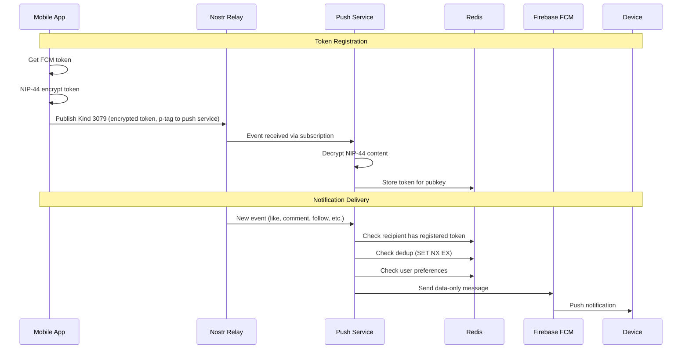

# Developer Guide

## Architecture Overview

divine-push-service is a single-app Nostr push notification service. It connects to Nostr relays, watches for events that should trigger notifications, and delivers them via Firebase Cloud Messaging (FCM).


```mermaid
sequenceDiagram
    participant App as Mobile App
    participant Relay as Nostr Relay
    participant Push as Push Service
    participant Redis
    participant FCM as Firebase FCM
    participant Device

    Note over App,Device: Token Registration
    App->>App: Get FCM token
    App->>App: NIP-44 encrypt token
    App->>Relay: Publish Kind 3079 (encrypted token, p-tag to push service)
    Relay->>Push: Event received via subscription
    Push->>Push: Decrypt NIP-44 content
    Push->>Redis: Store token for pubkey

    Note over App,Device: Notification Delivery
    Relay->>Push: New event (like, comment, follow, etc.)
    Push->>Redis: Check recipient has registered token
    Push->>Redis: Check dedup (SET NX EX)
    Push->>Redis: Check user preferences
    Push->>FCM: Send data-only message
    FCM->>Device: Push notification
```

## Event Kinds

| Kind | Direction | Purpose |
|------|-----------|---------|
| 3079 | Client → Relay → Service | Register FCM push token (NIP-44 encrypted) |
| 3080 | Client → Relay → Service | Deregister push token (NIP-44 encrypted) |
| 3083 | Client → Relay → Service | Update notification preferences (optional) |
| 30000 | Client → Relay → Service | NIP-51 people list; `d=notify` carries new-post ("bell") subscriptions. Public and unencrypted, and addressed to the world rather than `p`-tagged to the service |

See [NIP-XX Push Notifications](nip-xx-push-notifications.md) for the full protocol specification.

## Notification Types

The service watches for these event kinds and notifies the tagged recipient:

| Type | Event Kind | Trigger |
|------|-----------|---------|
| Like | 7 | Reaction to user's note (p-tag) |
| Comment | 1 | Reply to user's note (p-tag, with e-tag reference) |
| Comment | 1111 | NIP-22 comment on a user's video or article (notifies root author `P` and parent author `p`) |
| Follow | 3 | New contact list including user (p-tag) |
| Mention | 1 | Note mentioning user (p-tag, no e-tag reference) |
| Mention | 34236 | Addressable video tagging user (p-tag) |
| Repost | 16 | Repost of user's note (p-tag) |
| NewPost | 34236 | A creator the user belled published a video. The only type whose recipients do not come from a `p` tag — see [New-post subscriptions](#new-post-subscriptions-bells) |

> **Note:** Follow (kind 3) is defined but **not currently emitted** — the handler skips kind 3 because new-follow detection requires diffing contact-list state, which is not yet implemented. Likes, comments, mentions, reposts, and new posts are the types actually delivered today.

> **Note:** diVine video comments are NIP-22 `kind:1111`, not `kind:1`. They notify both the **root author** (uppercase `P` — the video owner, so they hear about comments on their video) and the **direct parent author** (lowercase `p` — for a reply, the parent comment's author). The two coincide for a top-level comment and are deduplicated. Every such push carries the authoritative root-video coordinate (see [Routing & attribution contract](#routing--attribution-contract)), so a reply to someone else's comment still routes to the correct video instead of a guessed one.

## FCM Payload Format

The FCM message carries **no top-level `notification` field** — the `data` map below is always present and is identical in shape for every notification type (only the `title`/`body` strings differ); every `data` value is a string. Per-platform delivery then diverges so that **one incoming push produces exactly one visible banner**:

- **Android** — data-only (`notification` and `android` unset). Android does not auto-display data messages, so the app renders the single banner itself from the `data` fields.
- **iOS** — the service attaches an APNS override: `aps.alert` (title/body) + `mutable-content: 1`, push-type `alert`, priority 10. The OS presents the single banner; a Notification Service Extension (if shipped) uses `mutable-content` to *enrich* that same banner, never to create a second one. `content-available` is deliberately omitted — see [Avoiding duplicate banners](#avoiding-duplicate-banners).

```json
{
  "data": {
    "type": "like",
    "eventId": "abc123...",
    "title": "New like",
    "body": "Alice liked your post",
    "senderPubkey": "def456...",
    "senderName": "Alice",
    "receiverPubkey": "789abc...",
    "receiverNpub": "npub1...",
    "eventKind": "7",
    "timestamp": "1712345678",
    "referencedEventId": "fedcba...",
    "referencedAddress": "34236:9b2f...:my-vine-id",
    "referencedKind": "34236",
    "referencedAuthorPubkey": "9b2f...",
    "referencedDTag": "my-vine-id"
  }
}
```

### Routing & attribution contract

Each field is either **authoritative** — the client may route to and attribute the notification from it directly — or **presentation-only** — safe to display, but never used to decide *which* target to open.

For a like, comment, or repost on a video the authoritative target is the addressable coordinate in `referencedAddress` (`kind:pubkey:d-tag`), taken verbatim from the triggering event's `a`/`A` tag. The owner pubkey is therefore the one the actor signed into the event, not the notification recipient.

For a kind 34236 video mention, the triggering event is itself the addressable target. Its `referencedEventId` is the video's event id, while `referencedAddress` and its component fields come from the video's own kind, author pubkey, and `d` tag.

> **Clients MUST NOT** synthesize a video coordinate by pairing `referencedDTag` (or any d-tag) with the *recipient's* pubkey. The recipient is not necessarily the video owner — e.g. a reply to another user's comment, or a mention — and doing so attributes the notification to the wrong (or a nonexistent) video. Use `referencedAuthorPubkey` / `referencedAddress` for ownership; fall back to `referencedEventId` when no coordinate is present.

When the triggering event is not addressable and carries no addressable reference (a follow, a mention in a plain note, or a like on a comment), the `referenced*` video fields are omitted and the client falls back to `referencedEventId`, then to the actor's profile.

#### Authoritative (routing / attribution)

| Field | Type | Description |
|-------|------|-------------|
| `type` | string | `like`, `comment`, `follow`, `mention`, `repost`, or `newPost`. Match the exact string: the first five are lowercase, `newPost` is camelCase |
| `eventId` | hex | The Nostr event that triggered the notification (the like/comment/repost/follow event itself); stable id for dedup and a routing fallback |
| `senderPubkey` | hex | Pubkey of the actor who triggered the event; routes follows and otherwise-unresolved taps |
| `receiverPubkey` | hex | Pubkey of the notification recipient |
| `referencedEventId` | hex | (optional) Target event. For a direct kind 34236 trigger this is the video event's own id. Otherwise it is root-aware: the NIP-22 uppercase `E` root scope when present, else the lowercase `e` tag — so comments anchor to the root video, not the parent comment |
| `referencedAddress` | string | (optional) Authoritative addressable target coordinate `kind:pubkey:d-tag`. Built from a direct kind 34236 trigger's own identity, or taken from the event's `A` (NIP-22 root) or `a` tag for an indirect reference |
| `referencedKind` | string | (optional) Kind component of `referencedAddress` (e.g. `34236`) |
| `referencedAuthorPubkey` | hex | (optional) Owner-pubkey component of `referencedAddress` — the authoritative video owner |
| `referencedDTag` | string | (optional) `d`-tag component of `referencedAddress`. Combine only with `referencedAuthorPubkey` (never the recipient) to rebuild the coordinate |

#### Presentation-only (display)

| Field | Type | Description |
|-------|------|-------------|
| `title` | string | Human-readable title (e.g. "New like") |
| `body` | string | Human-readable body (e.g. "Alice liked your post") |
| `senderName` | string | Display name or truncated npub of the sender |
| `receiverNpub` | bech32 | Bech32-encoded npub of the recipient |
| `eventKind` | string | Triggering Nostr event kind as a string (e.g. "7") |
| `timestamp` | string | Unix timestamp of the triggering event as a string |

The `referenced*` coordinate fields are emitted when the triggering event is a kind 34236 addressable video, or when it references an addressable event via `a`/`A` — currently videos referenced by likes, reposts, and NIP-22 comments (kind 1111). Likes/reposts/comments on non-addressable targets and follows/plain-note mentions omit them.

### iOS APNS shape

For a like, the APNS override the service emits is:

```json
{
  "aps": {
    "alert": { "title": "New like", "body": "Alice liked your post" },
    "mutable-content": 1
  },
  "type": "like",
  "eventId": "abc123...",
  "...": "remaining data fields (title/body live in aps.alert, not duplicated here)"
}
```

Headers: `apns-push-type: alert`, `apns-priority: 10`.

A *silent/background* push — a data message with neither `title` nor `body` — instead uses `aps.content-available: 1`, push-type `background`, priority 5. The current notification types always carry `title`/`body`, so this background shape is not emitted today.

### Avoiding duplicate banners

`content-available: 1` is intentionally **absent** from alert pushes. It is iOS's background-update flag: it wakes the app's background isolate, which would build a **second, local** banner on top of the OS-presented `aps.alert` — the duplicate-banner bug ([divine-push-service#20](https://github.com/divinevideo/divine-push-service/issues/20)). An `aps.alert` push is delivered reliably to **terminated** iOS apps *without* `content-available` (that flag matters only for *silent* pushes, which iOS throttles when the app is terminated), so omitting it costs no delivery reliability.

The contract is mirrored on the client ([divine-mobile#4760](https://github.com/divinevideo/divine-mobile/pull/4760)): the app renders a local banner **only** when the message has no OS-presented notification (`message.notification == null`, i.e. the Android data-only case). When iOS surfaces the `aps.alert` as `RemoteMessage.notification`, the client suppresses its local render. Result: **one push → one banner** across foreground, background, and terminated states.

### Client Handling

- **Android**: data-only — the app creates and displays the notification via `onMessageReceived` / background handler.
- **iOS**: the OS presents the `aps.alert`; an optional Notification Service Extension enriches it via `mutable-content`. The app must **not** create a separate local notification for these.
- **Foreground**: iOS does not OS-present in the foreground, so the app is the sole renderer; Android likewise renders once.
- **Taps**: tapping the OS-presented banner routes via the platform notification-open callbacks (e.g. `onMessageOpenedApp` / `getInitialMessage`) using the `data` fields; routing does not depend on `content-available`.

## Service Discovery

The push service exposes its public key via the `/health` endpoint:

```
GET /health
```

```json
{
  "status": "ok",
  "pubkey": "abc123..."
}
```

Clients use this pubkey to:
- Set the `p` tag on Kind 3079/3080/3083 events
- Encrypt the NIP-44 content to the service's key

## Deduplication

The service uses atomic Redis `SET NX EX` per-event keys to prevent duplicate notifications across multiple replicas. Each event that sends a push is claimed exactly once with a 7-day TTL.

Notify lists (kind 30000, `d=notify`) are the exception: they send no push, and claiming them would strand a subscriber's bells for the TTL if the handler failed. See [Ingestion](#ingestion) for why the claim buys nothing there.

## User Preferences

Users can optionally send a Kind 3083 event to control which notification types they receive. The decrypted content is:

```json
{ "kinds": [1, 3, 7, 16] }
```

This is a list of event kinds the user wants notifications for. If no preferences are set, the service uses defaults: text notes (1), follows (3), reactions (7), reposts (16), long-form content (30023), and videos from subscribed creators (34236).

## New-post subscriptions ("bells")

Every other notification type is triggered by someone acting on the recipient's
content, so recipients are read off the trigger event's `p` tags. New-post
notifications invert that: the recipient subscribed to a creator's output, and
the trigger event says nothing about who wants it.

### Source of truth

The subscription list is a public NIP-51 people list published by the client,
identified by a reserved `d` tag:

```json
{
  "kind": 30000,
  "tags": [
    ["d", "notify"],
    ["title", "Notify"],
    ["p", "<creator-pubkey-hex>"]
  ]
}
```

It is replaceable and unencrypted — the service has to be able to read it, so
there is no decryption step, unlike the kind 3079/3080/3083 control events. Any
kind 30000 arriving without exactly `d=notify` is ignored.

### Ingestion

`handle_notify_list_update` is routed **before** the control-event block and
deliberately outside its `p`-tag gate: these events are addressed to the world,
not to this service.

Two properties are load-bearing:

- **Notify lists are exempt from the replay horizon.** A list published three
  months ago and never touched since is still the user's current subscription
  set, so `is_notify_list` carves it out of the `is_event_too_old` check. The
  historical query is likewise unbounded by `since` and pages backward with
  `until`, using `notify_list_history_limit` as the per-page size valve.
  Without historical replay, a restart against a fresh Redis silently drops
  every bell until each user republishes.
- **Notify lists are exempt from the event claim.** `run()` claims every other
  event before routing it, so two replicas cannot send the same push twice.
  Notify lists send nothing, and `replace_notify_subscriptions` already rejects
  any list not strictly newer than the stored one, so the claim prevents nothing
  here. It does cost something: the claim is taken before routing and never
  released, so a transient Redis error inside the handler leaves it standing and
  the replay on the next restart skips the event as already-claimed. That
  subscriber's bells stay dark for the full `processed_event_ttl_secs`.
  `requires_event_claim` scopes the exemption with `is_notify_list`, the same
  kind-plus-`d`-tag check the horizon exemption uses.
- **An empty `p` list is legitimate**, not malformed. It means the user unbelled
  everyone, and it must clear the forward set and remove them from every reverse
  index.

`replace_notify_subscriptions` applies the diff in a single Lua script keyed on
the subscriber, because `notify_subs` and `notify_watchers` are two views of one
relation and must move together. The script re-checks the stored `created_at`
internally — a relay can deliver an older replacement after a newer one, and an
advisory check in the caller would still race.

The write order inside the script is deliberate. Redis runs a script without
interleaving anything else, but it does not roll one back, so a script that dies
partway keeps what it already wrote. Removals therefore clear the reverse index
before the forward one and additions write the forward index first, which keeps
`notify_subs` a *superset* of the true relation at every intermediate step. That
matters because `notify_subs` is the only record of which `notify_watchers:*`
keys name a subscriber, and removals are computed from it: a superset is
reconciled by the next list, while a forward index that is missing entries the
reverse index still holds cannot be repaired by anything the user can publish.
Do not "simplify" the diff back into a `DEL` and rebuild.

This covers the script failing on its own. It does not cover the index being
lost some other way, and the startup replay only partly does. A *total* loss
rebuilds: `notify_subs_ts` goes with everything else, so every replayed list
passes the guard and re-applies. A *partial* loss does not: if the index is gone
but `notify_subs_ts` survives, the replay re-fetches the same replaceable event
and the guard rejects it on exact-id match, leaving those bells dead until the
user next publishes a genuinely newer list. Deleting `notify_subs_ts` for the
affected subscribers is currently the only lever.

Ties on `created_at` resolve by NIP-01's rule, retaining the lowest event id.
The protocol requires clients to publish the complete list on every change, so
belling two creators in quick succession produces two full-list publishes that
can share a second; resolving those by arrival order would leave this service
holding a different list than the relay does, permanently. Watch the direction
when reading the script: an equal-timestamp event is applied when its id sorts
*below* the stored one, which reads backwards from "newer wins". An exact replay
is also applied as an idempotent repair path, so startup replay can reassert
`notify_watchers:*` entries if Redis lost the reverse index while the timestamp
guard survived.

Because the script runs as one blocking unit and Redis is single-threaded, the
creator list is bounded by `notify_list_max_creators` before it reaches Redis —
otherwise one user with an absurd number of bells stalls the instance for
everyone. Excess creators are dropped with a warning rather than the whole list
being rejected, so the user keeps the bells that fit instead of losing all of
them.

Atomicity here is not theoretical: production runs more than one replica, and the
event-level claim (`try_claim_event`) only stops two replicas processing *the same*
event — it does nothing about two different list events from the same subscriber
landing concurrently. Within a single replica the handler loop is sequential, so
this is purely a cross-replica concern.

The script writes `notify_watchers:*` keys that are not declared in `KEYS`, so it
is **not Redis Cluster safe**. This deployment uses single-instance Redis; moving
to Cluster requires resharding into one call per creator slot or a hash-tagged
key layout.

### Delivery

On each incoming kind 34236, `video_notification_targets` unions the video's
mention targets with `SMEMBERS notify_watchers:{author}`.

**Mention wins on overlap.** A user who both watches the creator and is mentioned
in the video gets one push, typed `mention`, because that is the more specific
signal.

The rule also holds across edits, which takes an extra step because the
per-recipient coordinate record is scoped by notification type. A delivered
mention writes the `newPost` record as well as its own: naming the video already
tells the recipient it exists, which is the whole content of a bell. A delivered
bell writes only its own, since "X posted a vine" says nothing about being
mentioned. Without the one-directional carry, a watcher who was `p`-tagged in
the original and dropped from an edit would be told "posted a new vine" about a
video they were already pushed about.

Delivery is capped at one push per (subscriber, creator) per
`new_post_rate_limit_secs`. The window is opened only on a *delivered* push
(check-then-set-on-success, mirroring the video-coordinate dedup) so a failed FCM
send does not burn the user's hour. The cost is that two replicas handling
different videos from the same creator in the same instant can both pass the
check and double-send — rare, bounded, and preferable to silently eating an hour
of notifications on an FCM blip.

When the rate limit suppresses a new-post push, the video-coordinate record is
still written. That video has been intentionally dropped for that watcher, and a
later NIP-33 edit should not re-announce it as a fresh post.

The rate limit is push-only. The in-app feed shows every post from belled
creators, so a user who receives one push for a six-post burst opens the app and
sees all six. That is intended.

## Redis Keys

| Key Pattern | Type | Description |
|-------------|------|-------------|
| `user_tokens:{pubkey}` | Set | FCM tokens registered for a pubkey |
| `token_to_pubkey` | Hash | Reverse mapping from token to owner pubkey |
| `stale_tokens` | Sorted Set | Token timestamps for cleanup |
| `dedup:{event_id}` | String | Per-event processing claim with TTL. Not taken for notify lists, which are idempotent by `created_at` and would be lost for the TTL if a failed handler left a claim standing |
| `dedup:34236:{type}:{owner}:{d-tag}:{recipient}` | String | Per-recipient video delivery decision, retained for the configured coordinate TTL (one year by default). `{type}` is the notification type (`newPost`, `mention`), so a bell and a mention for the same video coordinate keep independent records. A delivered mention writes both records, since naming the video already tells the recipient it exists; a delivered or rate-limited bell writes its own |
| `user_preferences:{pubkey}` | String | JSON notification preferences |
| `notify_subs:{subscriber}` | Set | Creators this user has belled. Diffed against each incoming replacement list. |
| `notify_subs_ts:{subscriber}` | String | `created_at:event_id` of the last applied notify list. Guards against out-of-order relay delivery of a replaceable event, and carries the id so a `created_at` tie resolves by NIP-01's lowest-id rule. Exact-id replays apply idempotently for repair. A bare integer written by an earlier build is read as a timestamp with no known id, which only makes the guard more conservative. |
| `notify_watchers:{creator}` | Set | Subscribers watching this creator. The hot read path — one `SMEMBERS` per incoming video. |
| `notify_rate:{subscriber}:{creator}` | String | New-post rate-limit window marker, TTL `new_post_rate_limit_secs` (one hour by default). |
